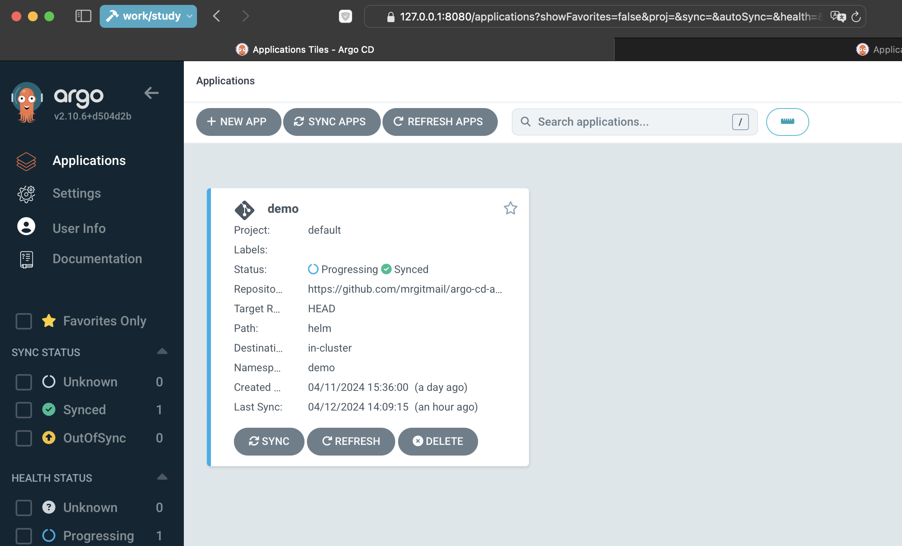
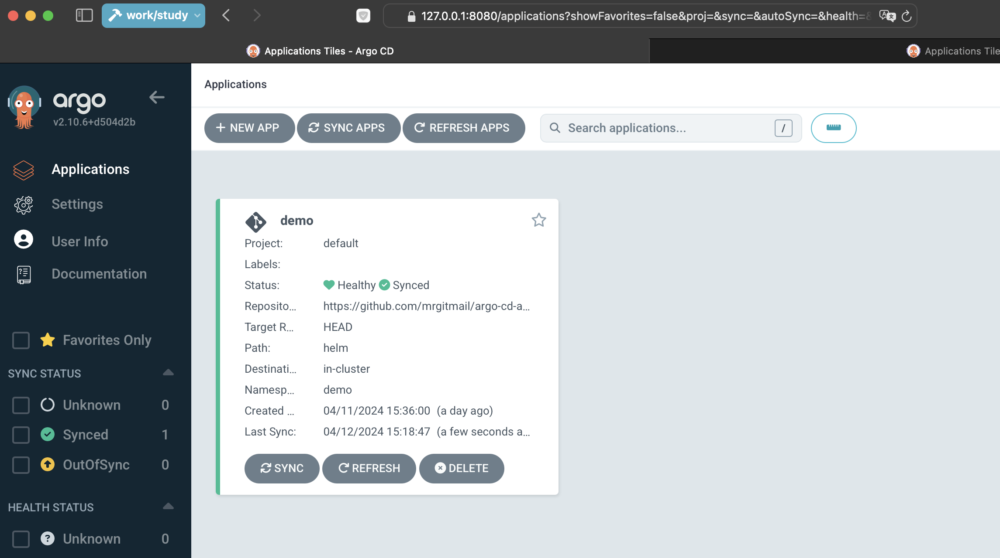

# Argo CD App

This Go application takes a PNG image as input with curl and returns ASCII art based on the PNG image.

## ArgoCD App Health Status

The ArgoCD application health status is currently "Progressing" due to the inability of the load balancer to obtain an external IP. This can be seen in the screenshot below:



To resolve the issue with the load balancer, the deployment has been switched to use a NodePort instead. The ArgoCD application health status is now "Healthy" with the NodePort configuration. This can be seen in the screenshot below:



## Deployment

The application is deployed using Argo CD. To make the app service accessible, run the following command:

```bash
kubectl port-forward -n demo svc/ambassador 8081:80&
```
## Usage

To use the application, you need to have curl installed. Use the following command to send a PNG image to the application and receive ASCII art in response:

```bash
curl -F 'image=@image.png' localhost:8081/img/
```
## Demo

Check out the demo of the application in action: [demo-mvp.gif](demo-mvp.gif).


